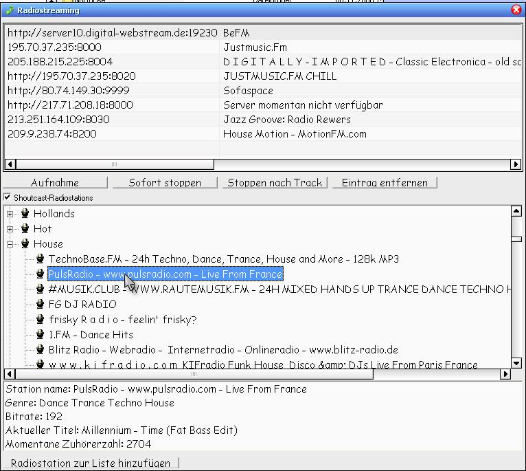



## RadioStreaming \- Shoutcast

### Description

This is to receive all shoutcast genre, to add radio stations to the main list and of course to record. Each MP3 file gets also its ID3 tag data.
 
### More Info
 

             |
---                |---
**Submitted On**   |2008-11-06 15:15:40
**By**             |[Mario Grimm](https://github.com/Planet-Source-Code/PSCIndex/blob/master/ByAuthor/mario-grimm.md)
**Level**          |Intermediate
**User Rating**    |5.0 (10 globes from 2 users)
**Compatibility**  |VB 6\.0
**Category**       |[Complete Applications](https://github.com/Planet-Source-Code/PSCIndex/blob/master/ByCategory/complete-applications__1-27.md)
**World**          |[Visual Basic](https://github.com/Planet-Source-Code/PSCIndex/blob/master/ByWorld/visual-basic.md)
**Archive File**   |[RadioStrea2133471182008\.zip](https://github.com/Planet-Source-Code/mario-grimm-radiostreaming-shoutcast__1-71369/archive/master.zip)

